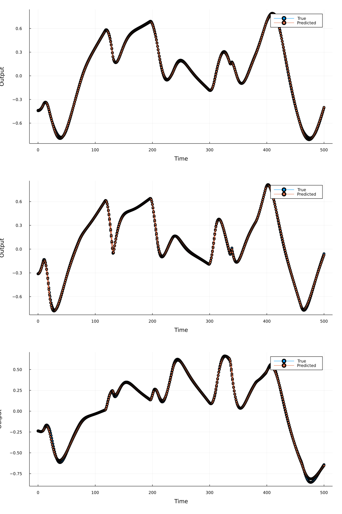

# ISSNeuralODE

Code accompanying the paper [Input-to-State Stable Neural Ordinary Differential Equations with Applications to Transient Modeling of Circuits](https://arxiv.org/abs/2202.06453), at L4DC 2022.

An example is provided in ```demo.jl```. The following figure shows an example of predicted vs. true trajectories:



<!-- 
Dependencies:

ProgressBars, Plots, MAT, DiffEqFlux, DifferentialEquations, DiffEqSensitivity, SteadyStateDiffEq, NonlinearSolve, IterTools, ParameterSchedulers, Flux, Zygote, Parameters, Setfield, Suppressor, PrettyTables, LaTeXStrings
 -->
